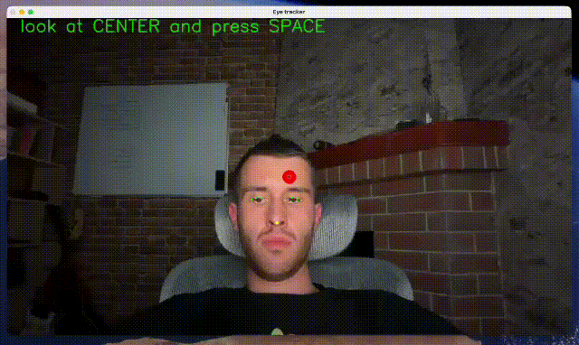
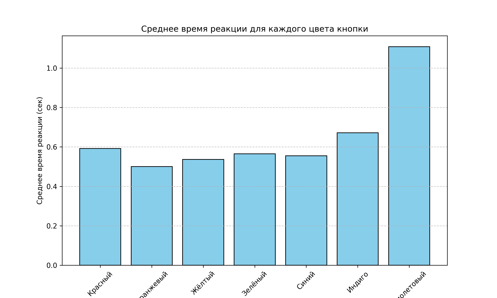
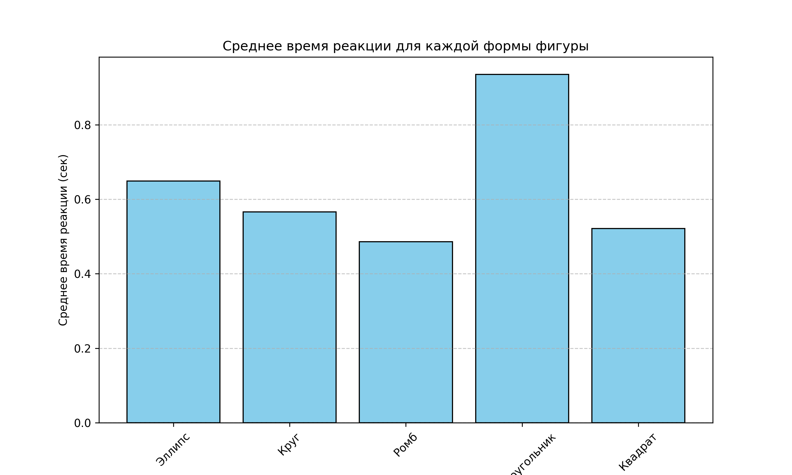
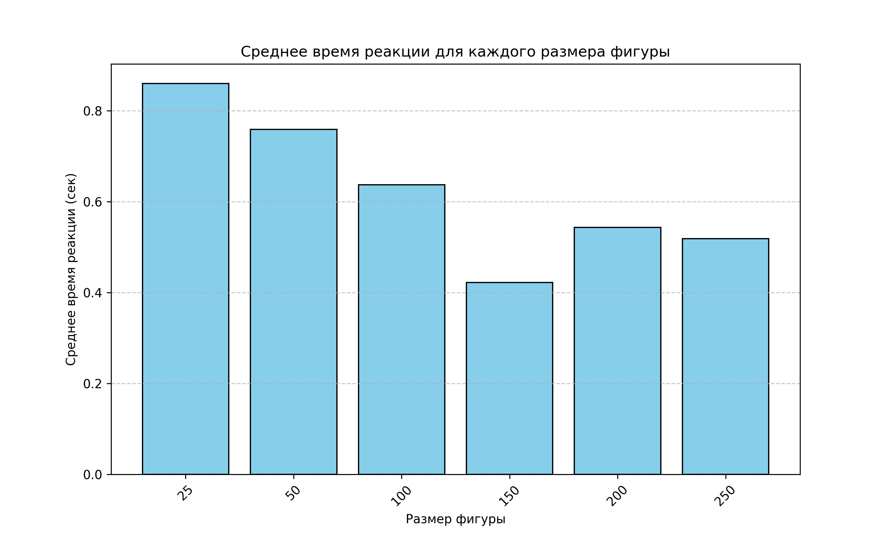
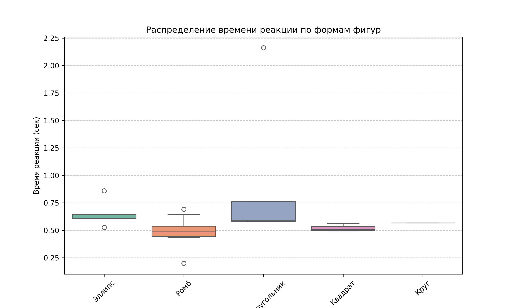
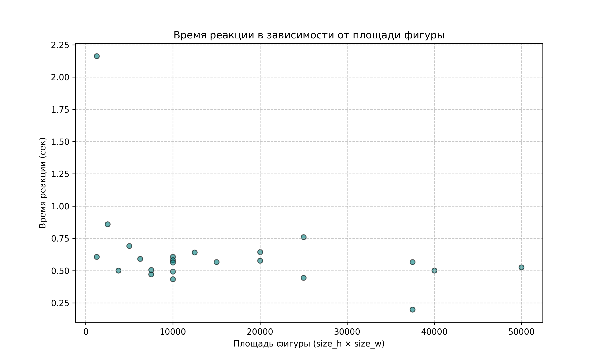

<div align="center">
<h1>Gaze Response Tracker</h1>
</div>
<div align="center">
<p>Десктопное приложение для регистрации реакции взгляда человека на появляющиеся геометрические объекты различной цветовой составляющей и контрастности</p>

      

</div>

## 🎯 Описание приложения для отслеживания реакции взгляда пользователя
Gaze Response Tracker — это инструмент, предназначенный для отслеживания скорости реакции человека на появляющиеся объекты на экране. Проект в корне использует тот же подход что и **gaze-tracker-app:** интерполяция координат зрачков в координаты точки взгляда на экране.

В отличии от **gaze-tracker-app** в данном проекте коэфициенты сгляживания, использующиеся при расчете зоны взгляда сильно уменьшены, для того чтобы не образовывался лаг при расчете координат и мы собирали данные, больше приближенные к реальности.

В результат работы данного приложения можно использовать для исследований в области изучения влияния разноконтрастных графических структур на реакции человеческого взгляда, анализирую собранные данные и построенные по ним инфографике (см. ниже).


## 👨🏻‍💻  Демонстрация работы программы
<div align="center">

</div>


## 🌟 Возможности
- 🔍 **Отслеживание реакций взгляда в реальном времени**
- 📊 **Визуализация собранных данных**
- 🖥️ **Простой интерфейс**


## 🛠 Установка
1. Клонируйте репозиторий:
   ```sh
   git clone https://github.com/savelevvaa/gaze-response.git
   ```
2. Перейдите в папку с проектом:
   ```sh
   cd gaze-response
   ```
3. Создайте и активируйте виртуальное окружение (Python <= 3.12):
   ```sh
   python -m venv venv
   venv\Scripts\activate  # Для Mac: source venv/bin/activate
   ```
4. Установите зависимости:
   ```sh
   pip install -r requirements.txt
   ```

## 🚀 Запуск приложения
Запустите скрипты приложения интерпретатором Python следующей командой:
```sh
python app.py
```


## 📸 Инфографика по собранным данным

Главное меню приложения             |  Меню выбора файла для исследования 
:-------------------------:|:-------------------------:
  |  

Справка по работе прилоежения  |  Окно конфигурации запуска трекера 
:-------------------------:|:-------------------------:
  |  

Калибровка работы трекера  |  Проведения испытания  
:-------------------------:|:-------------------------:
  |  

Диаграмма рассеивания взгляда  |  
:-------------------------:|
  | 


## 🤝 Вклад в проект
Буду рад новым идеям и предложениям! Открывайте issues и отправляйте pull requests.

## 📬 Контакты
По вопросам пишите на [savelevvaa@mail.ru](mailto:savelevvaa@mail.ru) или создавайте issue.
